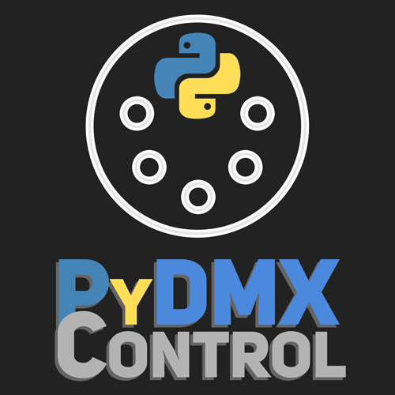

[](https://pypi.org/project/PyDMXControl/)
[](LICENSE)
[](https://pypi.org/project/PyDMXControl/)
[](PyDMXControl)
[](https://github.com/MattIPv4/PyDMXControl/commits)

# PyDMXControl

**A Python 3 module to control DMX via Python. Featuring fixture profiles and working with uDMX.**



## Installation

Install via pip (recommended)

    pip install PyDMXControl

## Features

* FIXTURE profiles per manufacturer ([see all included profiles](PyDMXControl/profiles))
  * Generic dimmer fixture included, single channel
  * RGB (3-channel) fixture with virtual dimmer built-in


* EFFECT module/library support ([see all packaged effects](PyDMXControl/effects))
  * Intensity dim chase provided, configurable speed and offset provided
  * Included is a fixture color chase effect, unlimited number of colors supported
  * Effects can be applied to individual fixtures or multiple as a group
  
  
* uDMX works out of the box
  * Package developed on and tested extensively with a uDMX system
  
  
* CUSTOM callbacks supported with an internal ticker
  * Have actions take place on their own at certain times using the callback ticker
  
  
* THREADED to allow continuous runtime
  * Run your own blocking scripts whilst PyDMXControl continues to output data
  
  
* WEBSITE control panel built in

## Example

An example of how to get a single dimmer working with PyDMXControl, 
providing the web control panel and the shell debug system once started.

```Python
# Import the uDMX controller from PyDMXControl,
#  this will be how the data is outputted.
from PyDMXControl.controllers import uDMXController

# Import the fixture profile we will use,
#  the simple Dimmer in this example.
from PyDMXControl.profiles.Generic import Dimmer

# Create an instance of the uDMX controller, 
#  this holds all the fixture information and outputs it.
# This will start outputting data immediately.
dmx = uDMXController()

# Add a new Dimmer fixture to our controller
#  and save it to a variable so we can access it.
# We give it a name so it's easier to identify in the debug control options.
fixture = dmx.add_fixture(Dimmer, name="My_First_Dimmer")

# Next, dim the intensity of the fixture from it's initial value of zero
#  to full, which is represented as 255 in DMX.
# This is done over 5000 milliseconds, or 5 seconds.
fixture.dim(255, 5000)

# We can now start the web control panel built into PyDMXControl.
# This will output the web address in console, but should be http://0.0.0.0:8000
# This runs in the background and so we can continue to do other things still.
dmx.web_control()

# The console debug mode can also be started if required,
#  this provides basic control options in the console of the program.
# This is blocking however and so the script will not continue past here until
#  the debug control is exited. This won't stop DMX output.
dmx.debug_control()

# Once the console debug mode is exited the script will continue, to stop it
#  exiting and stopping DMX output when can use a built-in sleep function.
# This sleep function will wait until enter is pressed in the console before continuing.
dmx.sleep_till_enter()

# With everything done, you can terminate the DMX output and the program by calling
#  the close method of the controller.
# This will cleanly close any threads in use and stop DMX output.
dmx.close()
```

> For a "real life" example, please take a look at [tests/home.py](tests/home.py) which is the setup I use in my office.

## What is the point of this?

Just messing around with using Python to control/send DMX.\
Supports fixture profiling; Has defaults for a standard fixture and fixtures that need virtual dimmers.\
Prebuilt profiles for generic fixtures (Single dimmer, RGB LED, Custom (set your own number of channels)).

Has a debug shell that allows control of fixture channel values and access to general callbacks. Additionally, provides 
an advanced web control panel with access to global callbacks, fixture helpers, fixture colors and control over 
individual fixture channels.

Currently only supports actual output via uDMX.\
There is also a print controller included that prints the DMX frames to console at the same rate it should output them
 to a data cable (this can cause issues though with other things printing as well).

If someone wants to buy me an Enttec USB DMX Pro then I'll try make it work with that too.

Thank you to Dave Hocker, author of [pyudmx](https://github.com/dhocker/udmx-pyusb/), for his work on pyudmx and his
 advice via email in solving some of the issues making this library behave with uDMX.

## Discussion, Support and Issues

For general support and discussion of this project, please join the Discord lounge server: https://discord.gg/qyXqA7y \
[](https://discord.gg/qyXqA7y)

To check known bugs and see planned changes and features for this project, please see the GitHub issues.\
Found a bug we don't already have an issue for? Please report it in a new GitHub issue with as much detail as you can!
